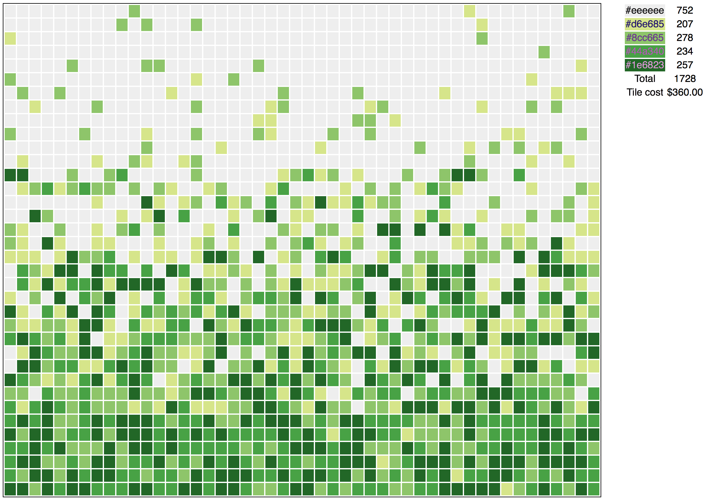

# tiles
A ceramic tile pattern generator

Tiles uses a YAML configuration file to generate random ceramic tile patterns. A sample YAML might look like this

```
# Set locale for proper currency formatting
locale: 'en_US.UTF-8'

# 48 inches
width: 48

# 36 inches
height: 36

# 1-inch tiles
tile_size: 1

# $30 per sq. ft.
sq_unit_price: 30

# smallest tile is 1-inch
smallest_unit_per_box: 12

colors: [
'#ECE7D4',
'#BCCA96',
'#107F7E',
'#0A516C',
]

# weights are listed top to bottom
color_weights: [
  [ 20, 20, 9, 6, 3, 0 ],
  [ 1,  3,  3, 6, 4, 1  ],
  [ 1,  2,  3, 5, 8, 8  ],
  [ 0,  0,  1, 4, 7, 12  ],
]

# show a border between sections in the output
show_section_boundaries: false
```

This file sets up a 4' x 3' pattern with 4 colors and 6 vertical sections with varying color weights defined top to bottom.
Any number of colors and section are possible but the number of sections must divide evenly into the number of rows ( height / tilesize).
This configuration will produces an HTML file with a pattern like the following

  


## Installation & usage

    pip install -r requirements.txt
    ./tiles.py

## License
```
MIT License

Copyright (c) [year] [fullname]

Permission is hereby granted, free of charge, to any person obtaining a copy
of this software and associated documentation files (the "Software"), to deal
in the Software without restriction, including without limitation the rights
to use, copy, modify, merge, publish, distribute, sublicense, and/or sell
copies of the Software, and to permit persons to whom the Software is
furnished to do so, subject to the following conditions:

The above copyright notice and this permission notice shall be included in all
copies or substantial portions of the Software.

THE SOFTWARE IS PROVIDED "AS IS", WITHOUT WARRANTY OF ANY KIND, EXPRESS OR
IMPLIED, INCLUDING BUT NOT LIMITED TO THE WARRANTIES OF MERCHANTABILITY,
FITNESS FOR A PARTICULAR PURPOSE AND NONINFRINGEMENT. IN NO EVENT SHALL THE
AUTHORS OR COPYRIGHT HOLDERS BE LIABLE FOR ANY CLAIM, DAMAGES OR OTHER
LIABILITY, WHETHER IN AN ACTION OF CONTRACT, TORT OR OTHERWISE, ARISING FROM,
OUT OF OR IN CONNECTION WITH THE SOFTWARE OR THE USE OR OTHER DEALINGS IN THE
SOFTWARE.

```
